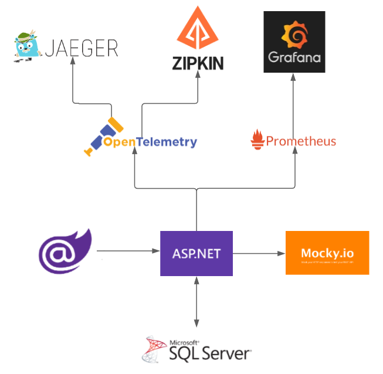

# Observability Demo

This demo app consists of a simple WebApi application to demonstrate the use of observability with OpenTelemetry, Prometheus, and Grafana.

## Projects

### WebApi

The demo WebApi

### WebApi.LoadTest

Blazor app to load test WebApi

## Architecture

## Technologies implemented:

- ASP.NET WebApi 5
- Blazor
- Entity Framework 5
- SQL Server
- Open Telemetry
- Jaeger
- Zipkin
- Prometheus
- Grafana

# Entity Framework

dotnet ef migrations add "Name" --project WebApi
dotnet ef database update --project WebApi

# Mocky

https://designer.mocky.io/design/confirmation

# Running the stack

1. Change the IP address (Ethernet Adapater 2) in 3 places
   - appsettings.json
   - 2 places in Startup.cs
   - Index.razor
2. docker-compose
   $ docker-compose build
   $ docker-compose up
3. Open URLs
   $ ./shortcut.ps1
   http://localhost:9411/zipkin/
   http://localhost:16686
   http://localhost:9090
   http://localhost:3000
   http://localhost:44000
   http://localhost:44000/metrics

# ZipKin

docker pull openzipkin/zipkin
docker run -d -p 9411:9411 openzipkin/zipkin
http://localhost:9411/zipkin/

#Jaeger
docker run -d --name jaeger -e COLLECTOR_ZIPKIN_HTTP_PORT=9412 -p 5775:5775/udp -p 6831:6831/udp -p 6832:6832/udp -p 5778:5778 -p 16686:16686 -p 14268:14268 -p 14250:14250 -p 9412:9412 jaegertracing/all-in-one:1.20
http://localhost:16686

# Prometheus

docker run -d --name prometheus -p 9090:9090 prom/prometheus
http://localhost:9090

# Grafana

docker run -d --name grafana -p 3000:3000 grafana/grafana
http://localhost:3000
admin:admin
